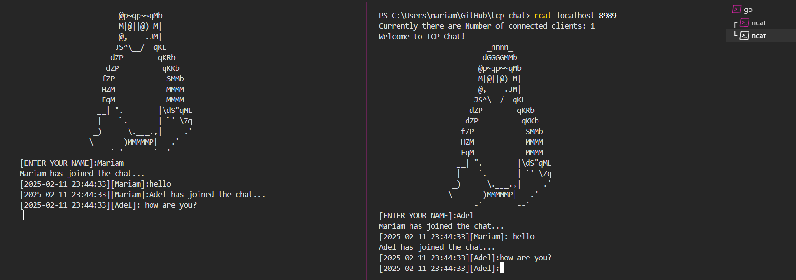

# NetChat

NetChat is a simple, Go-based implementation of the classic NetCat utility. It facilitates real-time communication between multiple clients over TCP, functioning as a lightweight group chat application. Each session is logged automatically, and users can dynamically change their display names.

## Features

- **TCP Server-Client Architecture**: Supports multiple clients connected to a single server.
- **Real-Time Messaging**: Clients can send and receive messages instantly.
- **Message Formatting**: Messages are timestamped and tagged with the sender's name.
- **Dynamic Username Change**: Change your display name anytime using the `\name` command.
- **Session Logging**: Automatically creates log files for each session, recording all messages.
- **Connection Notifications**: All clients are notified when a user joins or leaves the chat.
- **Persistent Chat History**: New clients receive all previous messages upon joining.

## Usage

### Starting the Server

To start the server, run the following command:

```bash
go run .
```

By default, the server listens on port `8989`. You can specify a custom port:

```bash
go run . 2525
```

### Connecting as a Client

To join the chat as a client, use NetCat or another terminal:

```bash
ncat localhost 8989
```

You'll be greeted with a welcome message and prompted to enter your name:

```
Welcome to NetChat!
         _nnnn_
        dGGGGMMb
       @p~qp~~qMb
       M|@||@) M|
       @,----.JM|
      JS^\__/  qKL
     dZP        qKRb
    dZP          qKKb
   fZP            SMMb
   HZM            MMMM
   FqM            MMMM
 __| ".        |\dS"qML
 |    `.       | `' \Zq
_)      \.___.,|     .'
\____   )MMMMMP|   .'
     `-'       `--'
[ENTER YOUR NAME]:
```

### Changing Your Name

To change your name while in the chat, type:

```
\name NewName
```

### Example Chat


## Log Files

Every chat session is logged automatically. Logs include timestamps, usernames, and messages, and are saved in the main directory with a timestamped filename.
